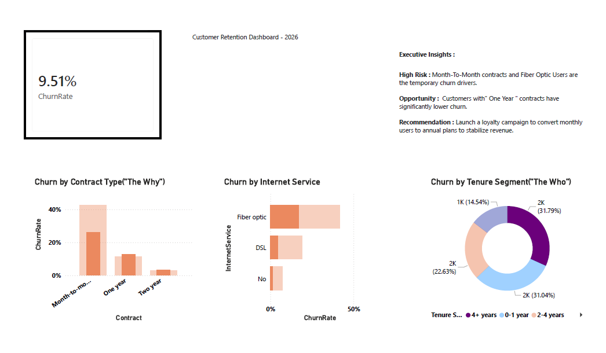

# FUTURE_DS_02

Telecom Customer Churn Analysis

Project Objective : 

The goal of this project was to analyze customer data to identify why customers are leaving and provide actionable insights to increase retention.

Tools and Technologies: 

1. Power BI desktop : Report Building and visualization.
2. Power Query : Data Cleaning and Transformation(ETL).
3.  DAX : Calculated Measures.

Data Process : 

1. ETL (Power Query ) : Cleaned the dataset, handled missing values , and created a numeric churn column (1/0).
2. DAX Measues : Calculated Total Customers , Total Churned , and a 26.54% Churn Rate .
3. Visualization : Developed a dashboard highlighting churn by contract type , internet service , and tenure.

Key Insights : 

1. Churn Rate : The overall churn rate is 26.54%.
2. Contract Risk : Month-to-month customers are significantly more likely to churn compared to those on one-year or two-year contracts.
3. Service Impact : Fiber Optic customers show a hugher churn rate, suggesting possible service or pricing issues in that segment .

Recommendation : 

Implement a targeted campaign to convert month-to-month users to annual plans , which could potentially reduce churn by providing more long-term stability.

How to open the dashboard : 

1. Screenshot - 
2. PowerBI file - Churn_Retention_Analysis.pbix

3. PowerBI file - Churn_Retention_Analysis.pbix

